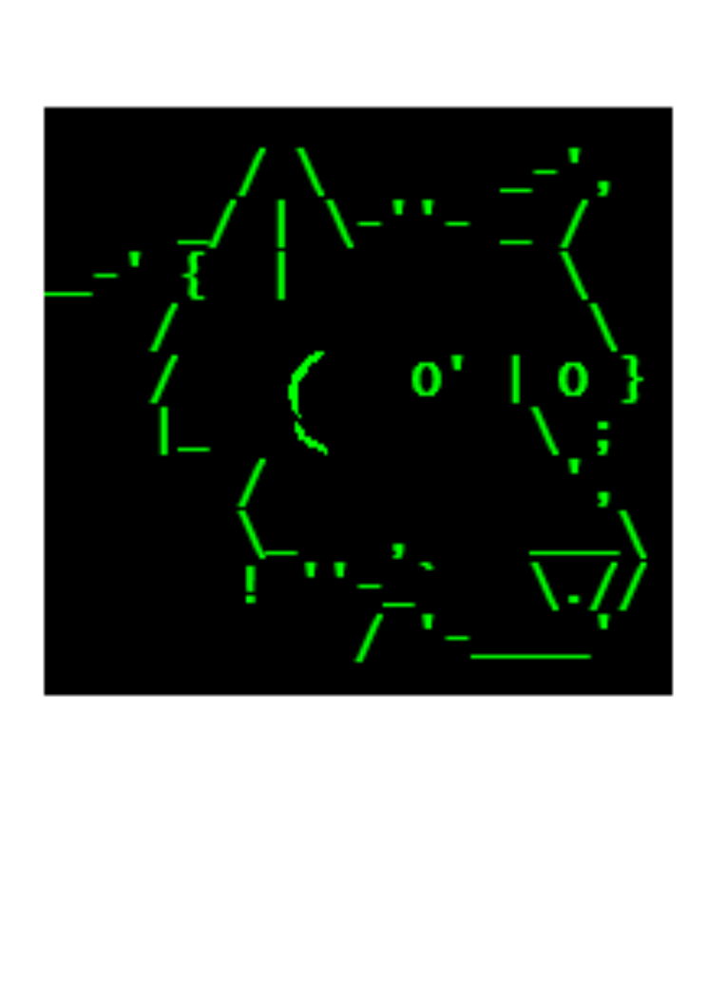

# Markdown howto


Note that this presentation is optimized for the default settings of scooch starter app
---
# Markdown headers

* `#` at beginning of line is a header 1
* `##` header 2
* `###` header 3
* ... header 6

Note: 
This is an authors note

--
# Markdown lists

De bullets are presented in a different order

* This bullet is shown first and immediatly
* This bullet third <!-- .element: class="fragment" data-fragment-index="2" -->
* This bullet second <!-- .element: class="fragment" data-fragment-index="1" -->

Markdown representation:
```md
* This bullet is shown first and immediatly
* This bullet third <!-- .element: class="fragment" data-fragment-index="2" -->
* This bullet second <!-- .element: class="fragment" data-fragment-index="1" -->
```
--
# Markdown cheatcheet

* For more markdown markup please look [here](https://github.com/adam-p/markdown-here/wiki/Markdown-Cheatsheet)
* Or a tutorial [here](http://www.markdowntutorial.com)
---
# Directives (1/2)

Under water commands directing the slides...

### Examples

```html
<!-- .slide: data-transition="none" -->
<!-- .slide: data-background="#33dd33" -->
<!-- .slide: data-autoslide="2000" -->
<!-- .slide: class="center" -->
<!-- .element: class="center" -->
<!-- .element: class="fragment" data-fragment-index="1" -->
```
* Applies it to one slide or element
* Combinations possible
--
# Directives (2/2)

* if you want to have your own markup on a directive like

```html
<!-- .element: class="myMarkup" -->
```

* You have to make sure that this `myMarkup` class is defined in your theme.
* More about themes in the `3. Advanced Scooch' presentation.

---
# Authors notes

if you put the following text at the end of a slide in your markdown file
you can add authors notes that will be shown in the presenters view.

`Note:`

e.g.

```text
    ---
    # title here
    
    bullets:
    * Bullet 1
    * Bullet 2
    
    Note:
    the text above the Note: is shown on slide but this text only in 
    the presenters view as presenter notes
    ---
```

* please press 's' now to experiment

Note: 
the text above the Note: is shown on slide but this text only in 
the presenters view as presenter notes
---
# Simple ascii drawing

Follow link <!-- .element: class="center" --> [asciiflow](http://asciiflow.com) for more information  

---
# Code blocks

### Python
```python
def main():
    print "Hello, world!"

if __name__ == '__main__':
   main()
```
by putting this on the slide

    ```python
    def main():
        print "Hello, world!"
    
    if __name__ == '__main__':
       main()
    ```
* but also many other languages as described in [this](https://github.com/github/linguist/blob/master/lib/linguist/languages.yml) file
--
## Code block highlighting (1/3)
When clicking next you will get a highlighted code block...
<span>
<span>
```python  
def main(): 
    print "Hello, world!"

if __name__ == '__main__':
   main()
```
<!-- .element: class="fragment grow" data-code-focus="2-3" -->
</span>
<!-- .element: class="fragment" data-code-focus="1" -->
</span>

On the next slide you will get the how

--

## Code block highlighting (2/3)
On your slide:

    ```python  
    def main(): 
        print "Hello, world!"
    
    if __name__ == '__main__':
       main()
    ```
    <!-- .element: class="fragment grow" data-code-focus="2-3" -->

The last html comment directs it.  
the `2-3` part tells it to highlight line 2 through 3 in the codeblock  
See the source of this file for more elaborate workings
--

## Code block highlighting (3/3)

Your template must have this css block in it to make it work.
values adjustable of course ;-)

```css
.line {
    display: block;
}

.line.focus {
    background: mediumvioletred;
    font-weight: bolder;
}
```
---
# Images

When clicking again the image will be zoomed into the screen
<span> 
 
</span> 
<!-- .element: class="fragment zoom-in" -->

slide text

```html
 <!-- .element: class="fragment zoom-in" data-fragment-index="0"-->
```
--
<section>
    <p class="fragment grow">grow</p>
    <p class="fragment shrink">shrink</p>
    <p class="fragment fade-out">fade-out</p>
    <p class="fragment fade-up">fade-up (also down, left and right!)</p>
    <p class="fragment current-visible">visible only once</p>
    <p class="fragment highlight-current-blue">blue only once</p>
    <p class="fragment highlight-red">highlight-red</p>
    <p class="fragment highlight-green">highlight-green</p>
    <p class="fragment highlight-blue">highlight-blue</p>
</section>
---
# Math

You can present formulas very nicely by using MathJax..  
and don't forget to right mouse click on the formula...
--
## Math (2)
* $\sum_{i=0}^n i^2 = \frac{(n^2+n)(2n+1)}{6}$
* $\alpha, \beta, \gamma$
* $x_i^2$
* $\left(\frac{\sqrt x}{y^3}\right)$
* $\to \rightarrow \leftarrow \Rightarrow \Leftarrow \mapsto$
* $\widehat cy$

Markdown representation of the above formulas

```md
* $\sum_{i=0}^n i^2 = \frac{(n^2+n)(2n+1)}{6}$
* $\alpha, \beta, \gamma$
* $x_i^2$
* $\left(\frac{\sqrt x}{y^3}\right)$
* $\to \rightarrow \leftarrow \Rightarrow \Leftarrow \mapsto$
* $\widehat cy$
```

Please go [here](http://meta.math.stackexchange.com/questions/5020/mathjax-basic-tutorial-and-quick-reference) for a quick tutorial
---
## Grapizo (1/2)


See next slide for the actual text to put on the slide...
--
## Grapizo (2/2)

```md

```
---
# Background green
<!-- .slide: data-background="#33dd33" -->
Very green background

by adding this to the slide

```html
<!-- .slide: data-background="#33dd33" -->
```
--
# Background red
<!-- .slide: data-background="#ff0000" -->
Very red background

by adding this to the slide

```html
<!-- .slide: data-background="#ff0000" -->
```
---
# Contact

You can contact my by pressing on my name :-)

Thanks,

[Ivo Woltring](http://www.ivonet.nl/home/contact).