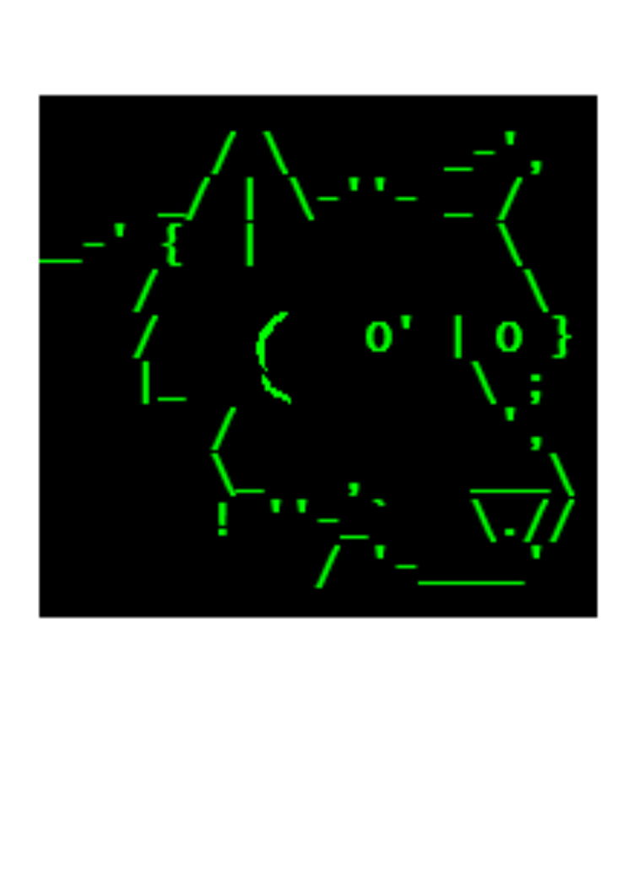

# Markdown howto

---
# Mardown headers

* `#` at beginning of line is a header 1
* `##` header 2
* `###` header 3

Note: 
This is a authors note

--
# Mardown lists

De bullets are presented in a different order

* This bullet is shown first and immediatly
* This bullet third <!-- .element: class="fragment" data-fragment-index="2" -->
* This bullet second <!-- .element: class="fragment" data-fragment-index="1" -->

Note: This is a authors note too
---
# Directives

Under water commands directing the slides...

### Examples

```html
<!-- .slide: data-transition="none" -->
<!-- .slide: data-background="#33dd33" -->
<!-- .slide: data-autoslide="2000" -->
<!-- .slide: class="center" -->
<!-- .element: class="fragment" data-fragment-index="1" -->
```
* Applies it to one slide or element
* Combinations possible
---
# Sinple ascii drawing

[asciiflow](http://asciiflow.com)

---
# Code blocks

### Python
```python

def main():
    print "Hello, world!"

if __name__ == '__main__':
   main()

```

* but also many other languages

--
# e.g. HTML
```html
 
```
---
# Images

When clicking again the image will be zoomed into the screen
 <!-- .element: class="fragment zoom-in" data-fragment-index="0"-->

---
# Math

You can present formulas very nicely by using MathJax..  
and don't forget to right mouse click on the formula...
--
## Math (2)
* $\sum_{i=0}^n i^2 = \frac{(n^2+n)(2n+1)}{6}$
* $\alpha, \beta, \gamma$
* $x_i^2$
* $\left(\frac{\sqrt x}{y^3}\right)$
* $\to \rightarrow \leftarrow \Rightarrow \Leftarrow \mapsto$
* $\widehat cy$
--
## Math (3)

Please go [here](http://meta.math.stackexchange.com/questions/5020/mathjax-basic-tutorial-and-quick-reference) for a quick tutorial
---
## Grapizo


---
# Background green
<!-- .slide: data-background="#33dd33" -->
Very green background
--
# Background red
<!-- .slide: data-background="#ff0000" -->
Very red background
---
# Other examples

* [slides](https://github.com/hakimel/reveal.js/wiki/Example-Presentations)